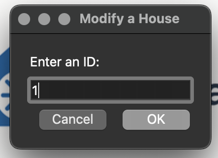

# RealtyVault 🏠

RealtyVault is a desktop application built with Python and PyQt6 that helps manage real estate property information. This project demonstrates my skills in desktop application development, database management, and user interface design. This was done as part of a project for my Advanced Programming course.


## 🚀 Features

### Main Interface
The application features an intuitive menu-driven interface with File and Help menus for easy navigation.

 

### Property Management

#### Add Properties
Add new properties to the database with detailed information, including property images:
  

#### Modify Properties
Update existing property information seamlessly:

 

#### Search Properties
Find specific properties using the search functionality:
 

#### Comprehensive Reporting
View and analyze all properties in the database:


- **Database Integration**: MySQL backend for reliable data storage
- **Modern Design**: Clean interface with custom icons and branding
- **Help System**: Built-in help and about sections for user guidance
  

## 🛠️ Technologies Used

- **Python**: Core programming language
- **PyQt6**: GUI framework
- **MySQL**: Database management
- **SQL**: Database queries and management
- **Object-Oriented Programming**: Modular and maintainable code structure

## 💻 Technical Implementation

### Architecture
- **MVC Pattern**: Separation of concerns between data, logic, and presentation
- **Modular Design**: Each functionality is encapsulated in its own class
- **Event-Driven Programming**: Utilizing PyQt6's signal and slot mechanism

### Key Components
- `DBConnection.py`: Database connection and query handling
- `House.py`: Property data model
- `main.py`: Application entry point and main window
- Custom UI files for each feature (Add, Modify, Search, Report)

## 🚀 Getting Started

### Prerequisites
- Python 3.10 or higher
- MySQL 8.0
- PyQt6

### Installation

1. Clone the repository
```bash
git clone https://github.com/ebrevan/realtyvault.git
cd realtyvault
```

2. Create and activate virtual environment
```bash
python -m venv .venv
source .venv/bin/activate  # On Windows: .venv\Scripts\activate
```

3. Install dependencies
```bash
pip install PyQt6 mysql-connector-python
```

4. Set up the database
```bash
mysql -u root -p < sql/RealState.sql
```

5. Run the application
```bash
python py_files/main.py
```

## 🎯 Skills Demonstrated

- **Desktop Application Development**: Created a fully functional GUI application
- **Database Design & Management**: Implemented MySQL database integration
- **UI/UX Design**: Developed an intuitive and responsive user interface
- **Software Architecture**: Applied MVC pattern and modular design principles
- **Version Control**: Used Git for project management
- **Documentation**: Created comprehensive documentation and comments

## 🌟 Future Enhancements

- Advanced search filters
- PDF report generation
- Data analytics dashboard
- Cloud backup integration
- Mobile application version

## 📝 Project Structure
```
realtyvault/
├── py_files/           # Python source files
├── ui_files/          # PyQt6 UI definition files
├── images/            # Application icons and images
├── sql/              # Database schema and setup
└── README.md         # Project documentation
```

## 👨‍💻 About Me

I'm a Computer Engineering student passionate about software development and looking for internship opportunities. This project showcases my ability to:
- Build full-featured desktop applications
- Work with databases and GUI frameworks
- Write clean, maintainable code
- Implement proper software architecture
- Create comprehensive documentation

## 📬 Contact

- LinkedIn: [Here](https://www.linkedin.com/in/ebrevan/)
- Email: ebrevan@outlook.com
- GitHub: [@ebrevan](https://github.com/ebrevan)

## 📄 License

This project is licensed under the MIT License - see the LICENSE file for details." 
